# Trening modelu na środowisku CartPole-v1

## Przebieg treningu

<table>
    <tr>
        <th>Domyślne hiperparametry</th>
        <th>Podwójna głowa krytyka</th>
    <tr>
    <tr>
        <td>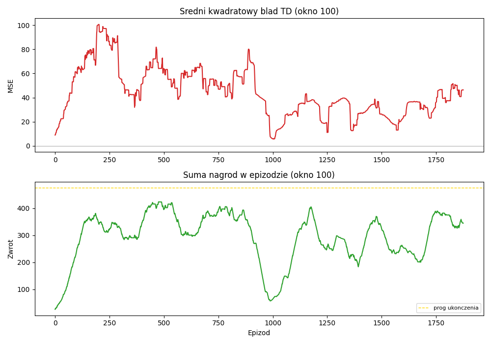</td>
        <td>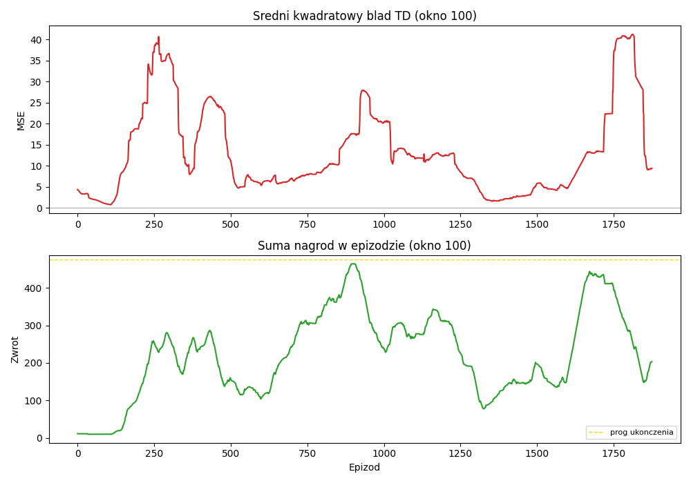</td>
    </tr>
    <tr>
        <th>Mniejsza sieć</th>
        <th>Duży lr</th>
    </tr>
    <tr>
        <td>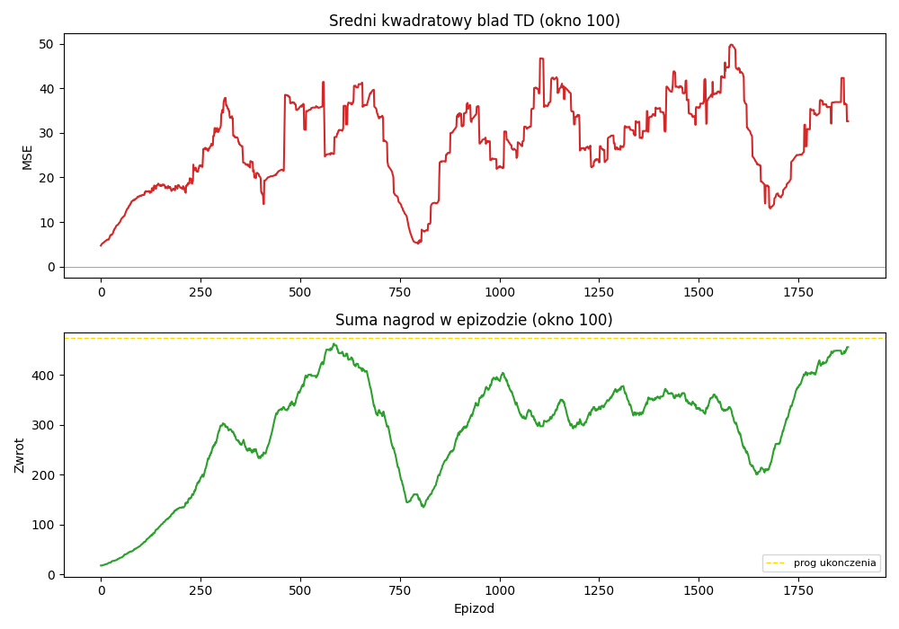</td>
        <td>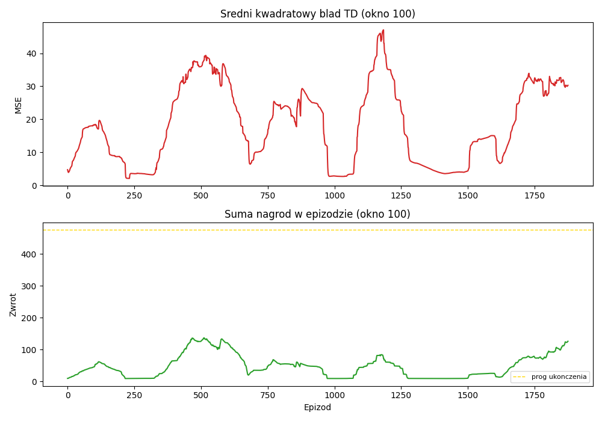</td>
    </tr>
</table>

Widać, że stabilność treningu nie jest najlpesza. Najstabilnijszy jest model z małą siecią. Model z podwójną głową jest bardzo niestabilny. Model z dużym $lr$ nie wytrenował się wcale. Wszystkie modele zaliczyły w pewnym momencie kolaps polityki co jest niestety charakterystyczne dla tego typu modeli.

Nagrody treningowe wydają się dodatnio skorelowane z wartością błędu wartościowania krytyka.

## Wartości stanu
Przetestowałem modele na siatce wartości stanu dla par:
- Pozycja wózka i prędkość wózka
- Kąt drążka i prędkość kątowa drążka

Wykresy przedstawiłem jako powierzchnie 3D, gdzie oś Z reprezentuje wartość stanu.

### Pozycja wózka i prędkość wózka

<table>
    <tr>
        <th>Domyślne hiperparametry</th>
        <th>Podwójna głowa krytyka</th>
    <tr>
    <tr>
        <td>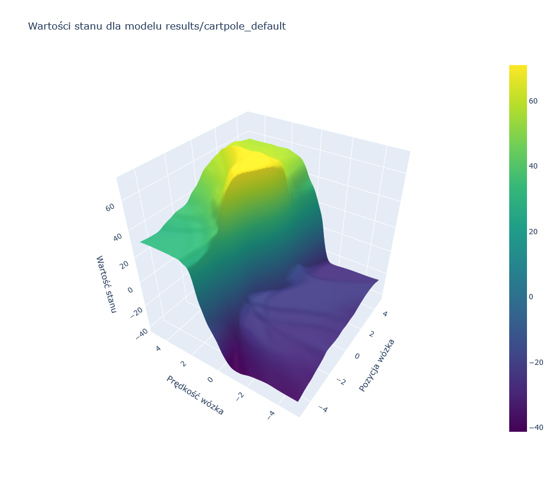</td>
        <td>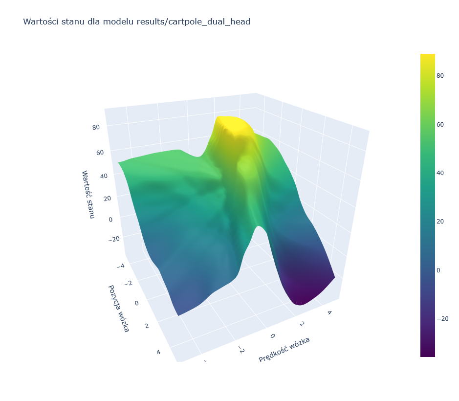</td>
    </tr>
    <tr>
        <th>Mniejsza sieć</th>
        <th>Duży lr</th>
    </tr>
    <tr>
        <td>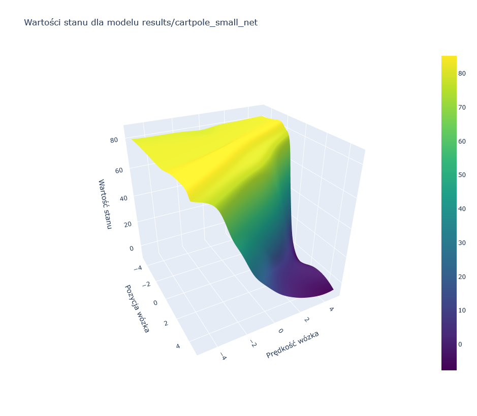</td>
        <td>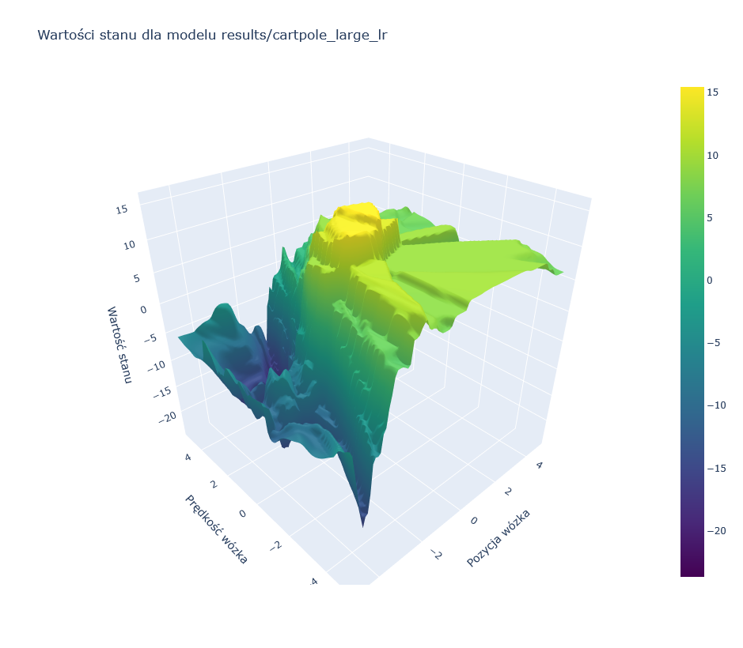</td>
    </tr>
</table>

***UWAGA: aby dobrze pokazać powierzchnię funkcji, ustawiłem różną projekcję wykresu więc osi x i y mogą się różnić między wykresami.***

Intuicyjnie model z podwójną głową ma stabilniejsze wartościowanie bo jest ono symetryczne. Za to najgładszą funkcję ma model z małą siecią co jest spodziewane. Model z dużym $lr$ ma bardzo poszarpaną i brzydką funkcję nagrody co jest również spodziewane bo model się nie wytrenował.

### Kąt drążka i prędkość kątowa drążka

<table>
    <tr>
        <th>Domyślne hiperparametry</th>
        <th>Podwójna głowa krytyka</th>
    <tr>
    <tr>
        <td>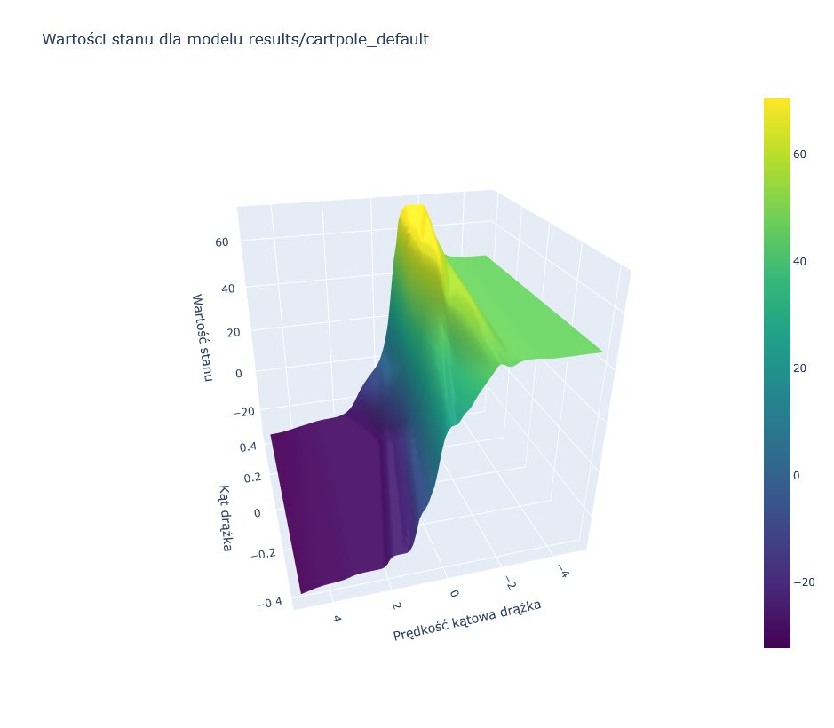</td>
        <td>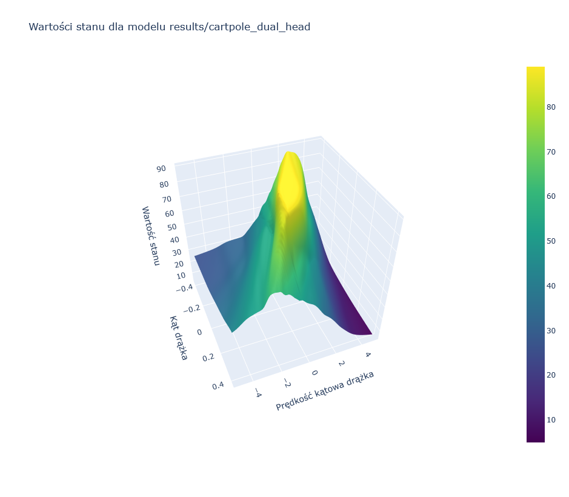</td>
    </tr>
    <tr>
        <th>Mniejsza sieć</th>
        <th>Duży lr</th>
    </tr>
    <tr>
        <td>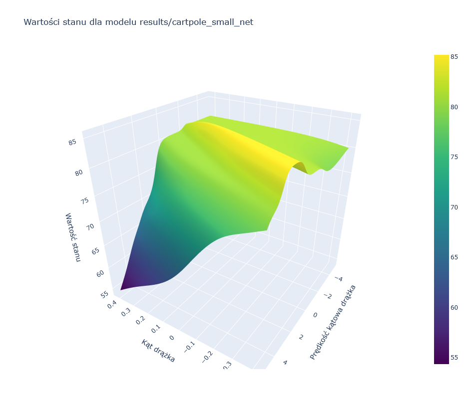</td>
        <td>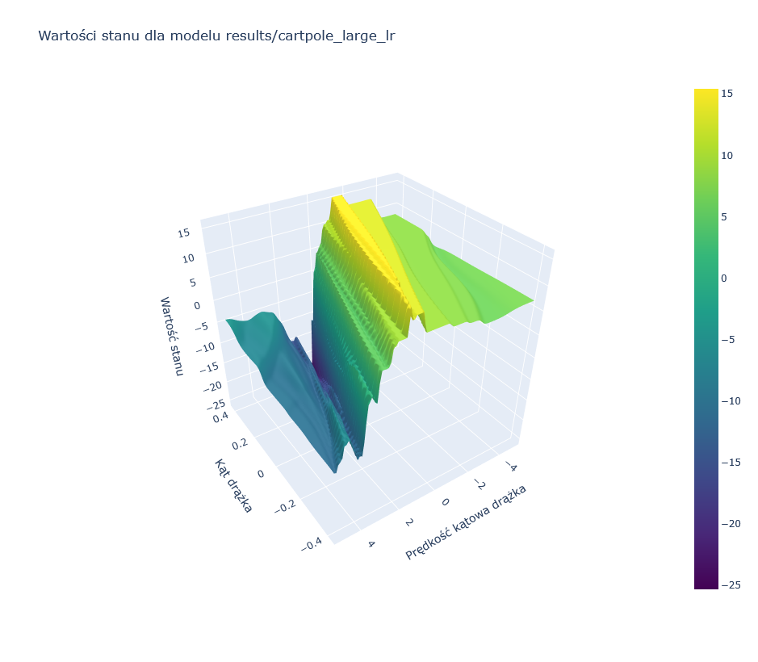</td>
    </tr>
</table>

***UWAGA: aby dobrze pokazać powierzchnię funkcji, ustawiłem różną projekcję wykresu więc osi x i y mogą się różnić między wykresami.***

Intuicyjnie ponownie bardziej stabilny wydaje się model z podwójną głową bo wartościowanie jest symetryczne. Ponownie najgładszą funkcję ma model z małą siecią. Ponownie model z dużym $lr$ ma bardzo poszarpaną i brzydką funkcję nagrody.

# Trening modelu na środowisku LunarLander-v3

## Przebieg treningu

<table>
    <tr>
        <th>Domyślne hiperparametry</th>
        <th>Entropia 0</th>
    <tr>
    <tr>
        <td>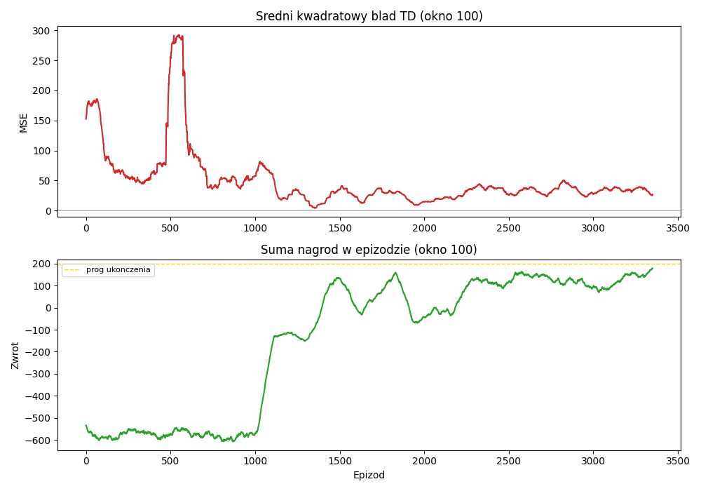</td>
        <td>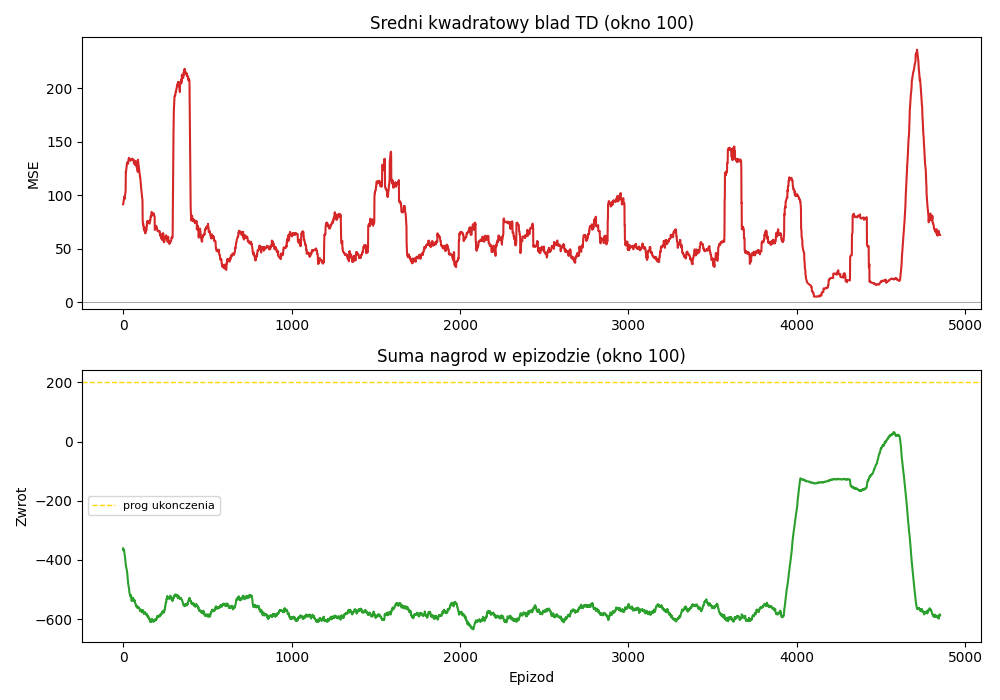</td>
    </tr>
</table>

Tym razem model na domyślnych hiperparametrach trenował się całkiem stabilnie, i skończył się trenować nawet przed końcem epizodów treningowych. Model z entropią 0 nie trenował się w ogóle, bo nie eksplorował środowiska. Raz przez chwilę się nawet czegoś nauczył, ale szybko zaliczył kolaps polityki.

## Wartości stanu
Testowałem tylko model na domyślnych hiperparametrach. 

Na podstawie obserwacji tego jak agent się porusza po środowisku, zauważyłem
że agent nauczył się lądować na prawej chorągiewce platformy. Przez to czasami zdarza mu się zsunąć po zboczu, i nie udaje mu się już tego nadrobić prawym silnikiem.

Dolny silnik uruchomiony jest raczej większość czasu lotu, a silniki boczne są używane do korekty przechyleń. Gdy pojazd jest przechylony w prawo (tj, prawy bok jest niżej niż środek), to uruchamiany jest prawy silnik boczny.

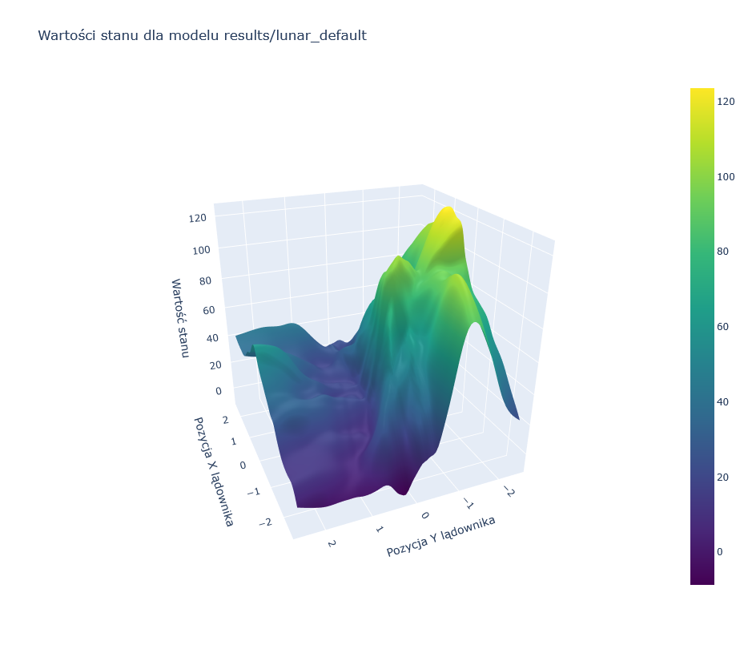

Widać, że krytyk wartościuje stany niższą wartością - mniej kara, model w pozycjach bliskich zera. Bardzo natomiast kara wartości poniżej Y=0, czyli gdy lądownik spadł poniżej platformy.

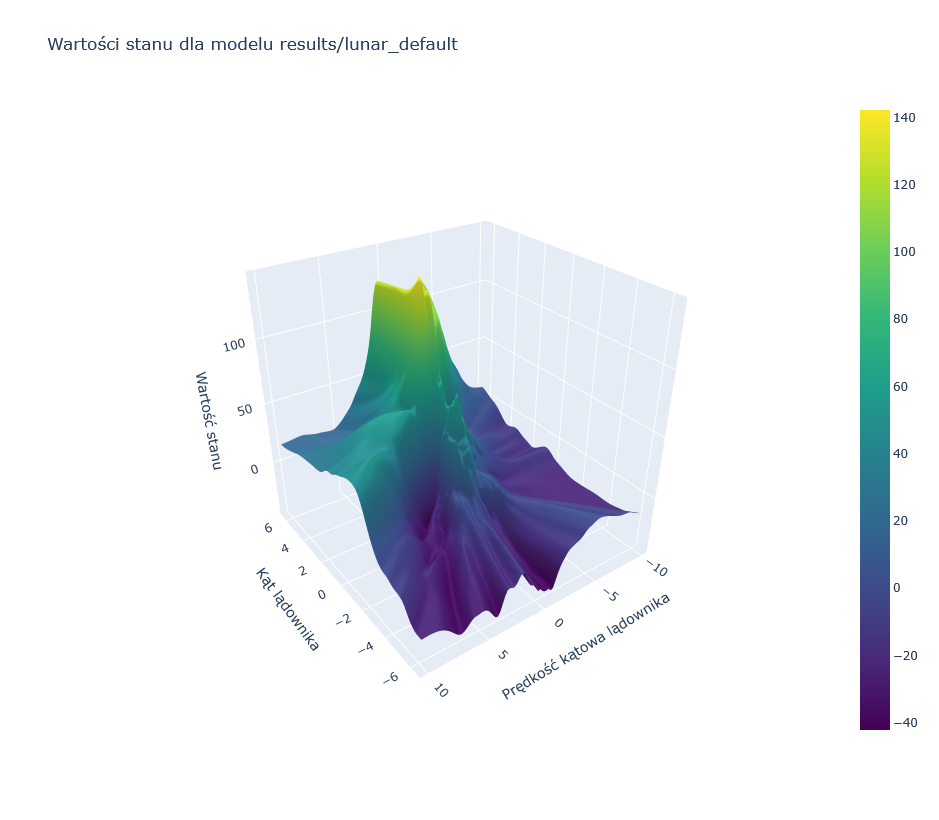

Dla kąta i prędkości kątowej, widzimy że krytyk bardzo kara stany w których lądownik jest mocno przechylony ale nie próbuje się obrócić. Co ciekawe mniej kara taki sam stan dla obrotu w jedną stronę co może sugerować, że lądownik naturalnie używa jednego silnika bocznego więcej i dlatego ląduje właśnie na prawej chorągiewce.

