# Podstawowy eksperyment
Pierwszy eksperyment to uruchomienie wszystkich zaimplementowanych algorytmów na podstawowym problemie zaimplemenotwanym 
w zadaniu. Bandyci:
learners = [
        RandomLearner(),
        ExploreThenCommitLearner(m=5, color="green"),
        EGreedyLearner(epsilon=0.1, color="red"),
        EGreedyLearner(epsilon=0.0, color="orange"), # full greedy
        EGreedyLearner(epsilon=0.1, bias={arm: 0.1 for arm in POTENTIAL_HITS.keys()}, color="purple"), # more exploration
        UCB1Learner(c=1.0, color="blue"),
        UCB1Learner(c=2.0, color="cyan"),
        GradientLearner(lr=0.3, color="yellow"),
        ThompsonLearner(color="pink"),
    ]

- `RandomLearner` - losowy wybór ramienia
- `ExploreThenCommitLearner` - eksploracja przez `m = 5` kroków, a następnie wybór najlepszego ramienia
- `EGreedyLearner` - z prawdopodobieństwem `e = 0.1` eksploracja, a z prawdopodobieństwem `1 - e` wybór najlepszego ramienia
- `EGreedyLearner` - full greedy, czyli zawsze wybierający najlepsze ramię
- `EGreedyLearner` - z prawdopodobieństwem `e =0.1` i dodaktowym biasem na ramiona
- `UCB1Learner` - algorytm Upper Confidence Bound z parametrem `c = 1.0`
- `UCB1Learner` - algorytm Upper Confidence Bound z parametrem `c = 2.0`
- `GradientLearner` - algorytm gradientowy z parametrem `lr = 0.3`
- `ThompsonLearner` - algorytm Thompson Sampling

Wynik poniżej:

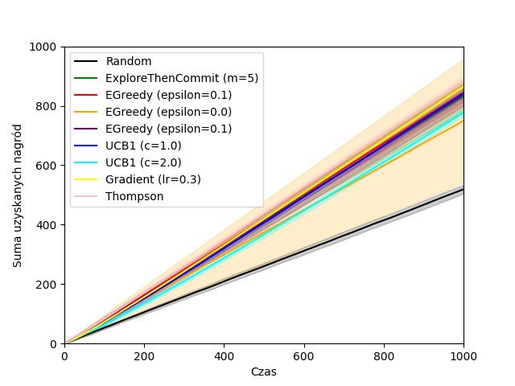

Wydaje się że najlepiej radzi sobie `GradientLearner` i `ThompsonLearner`.

# Studium parametryczne:

Zdecydowałem się na zbadanie wpływu parametrów bandytów w porównaniu do siebie. Dodatkowo dodałem do każdego bandyty wykres regretu, który pokazuje jak bardzo dany bandyta odstaje od optymalnego rozwiązania.

<table>
  <tr>
    <td>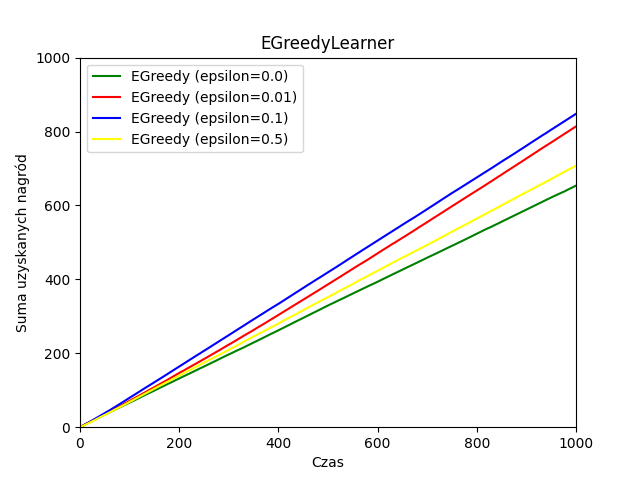</td>
    <td>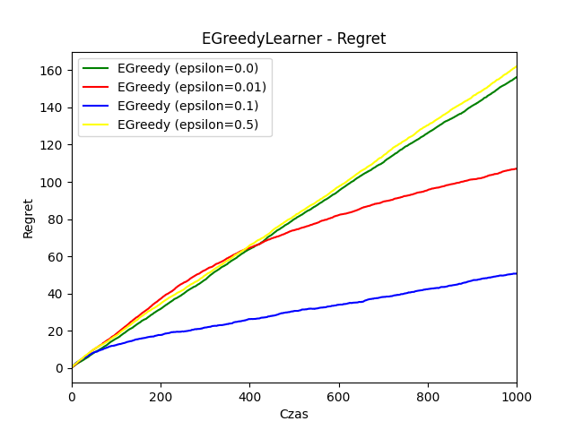</td>
  </tr>
  <tr>
    <td>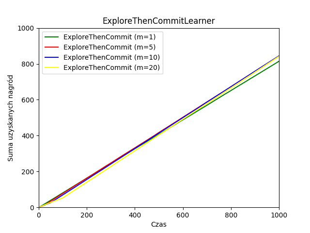</td>
    <td>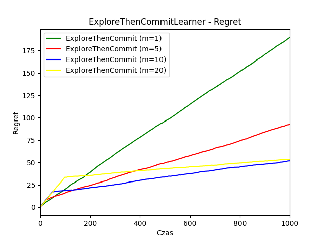</td>
  </tr>
  <tr>
    <td>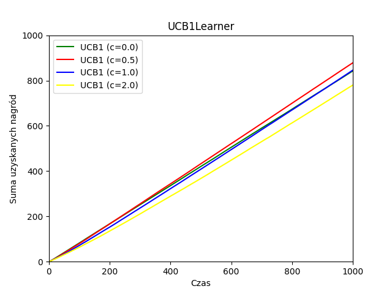</td>
    <td>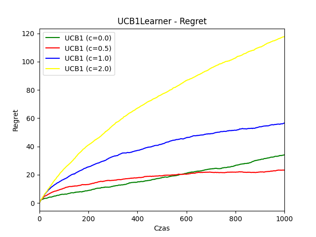</td>
  </tr>
  <tr>
    <td>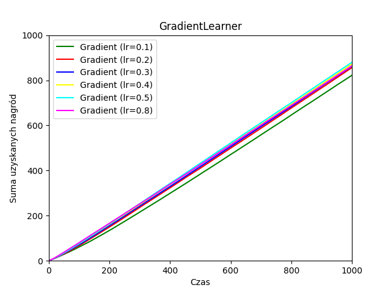</td>
    <td>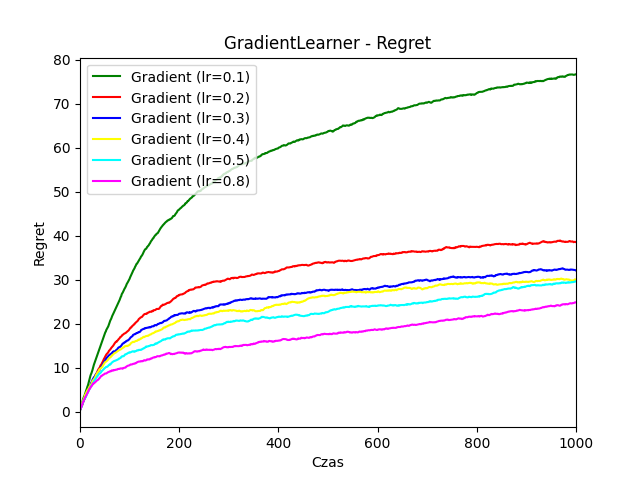</td>
  </tr>
</table>

W każdej kategorii najlepszymi parametrami okazały się:
- `EGreedyLearner` - `epsilon = 0.1`
- `ExploreThenCommitLearner` - `m = 10`
- `UCB1Learner` - `c = 0.8`
- `GradientLearner` - `lr = 0.5`

# Bandyci niestacjonarni
W kolejnym eksperymencie porównałem najlepszych bandytów z poprzedniego eksperymentu w środowisku, gdzie prawdopodobieństwa trafienia zmieniają się w czasie o krok z rozkładu Normalnego $\mathcal{N}(0, 0.05)$.

Dla porównania najpierw środowisko stacjonarne:

<table>
  <tr>
    <td>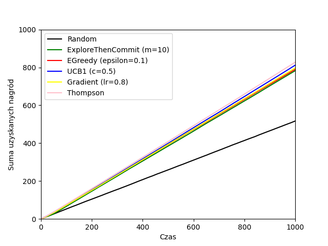</td>
    <td>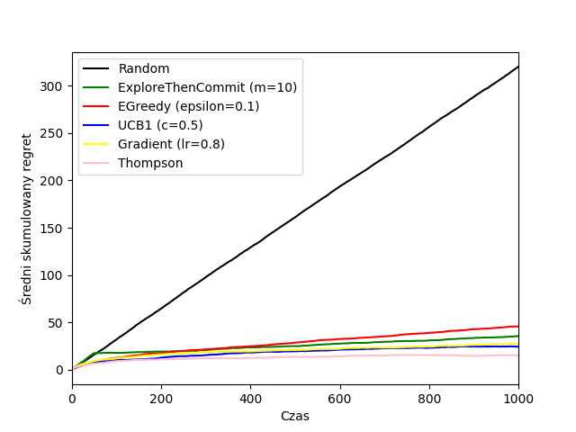</td>
  </tr>
</table>

I środowisko niestacjonarne:

<table>
  <tr>
    <td>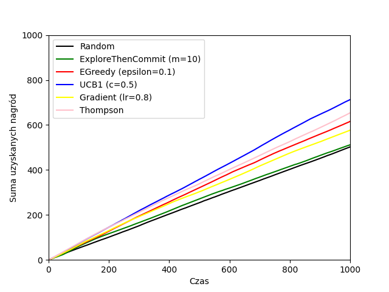</td>
    <td>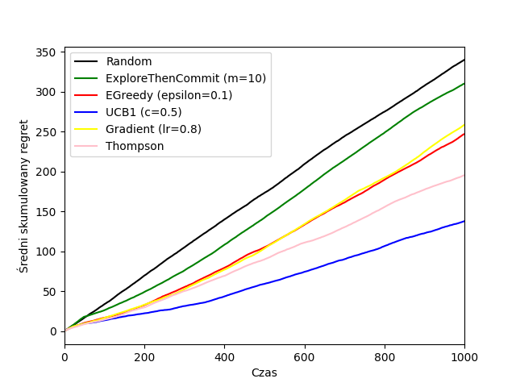</td>
  </tr>
</table>

Widać dużo gorsze wyniki, ale też zmianę kolejności najlepszych bandytów. UCB1 zaczyna radzić sobie lepiej niż Thompson mimo, że wcześniej to on był faworytem.
