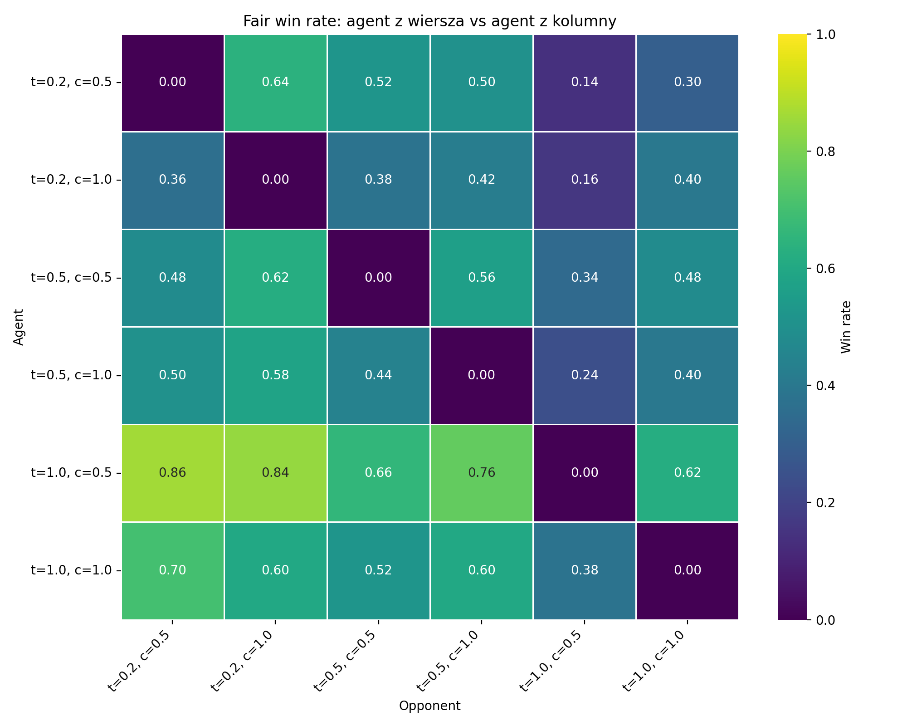
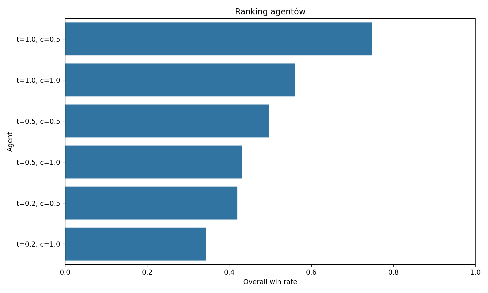
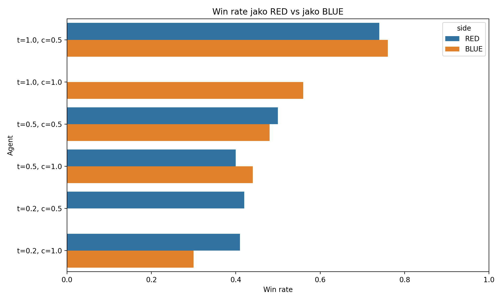
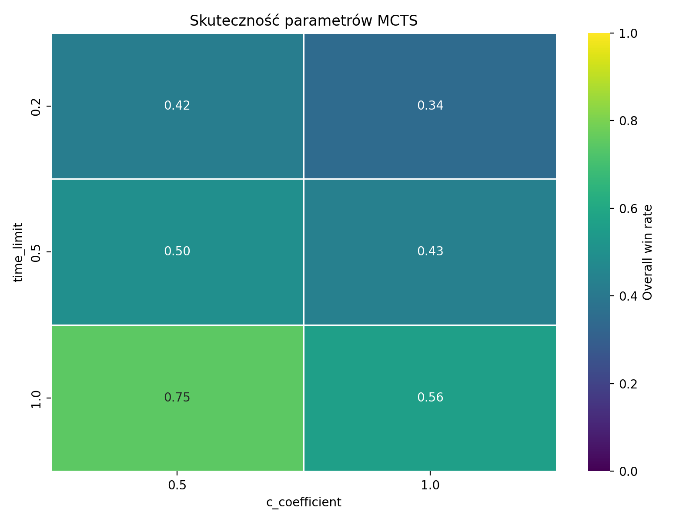
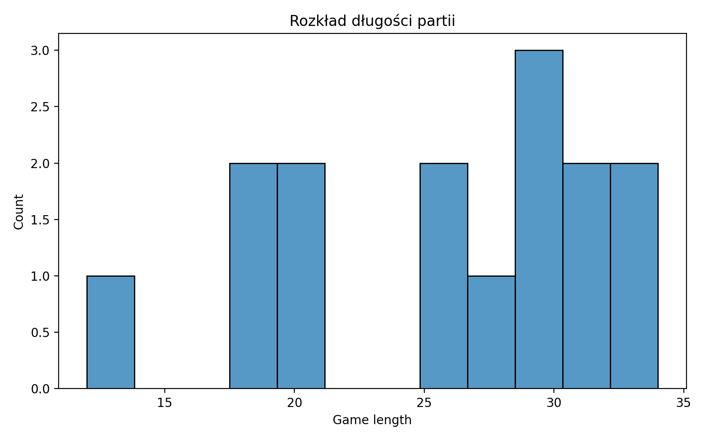

Jako ciekawszy eksperyment, zdecydował się stworzyć pojedynek agentów MCTS z różnymi parmetrami. Testowani agenci:
- `time_limit=0.2, exploration_weight=0.5`
- `time_limit=0.5, exploration_weight=0.5`
- `time_limit=1.0, exploration_weight=0.5`
- `time_limit=0.2, exploration_weight=1.0`
- `time_limit=0.5, exploration_weight=1.0`
- `time_limit=1.0, exploration_weight=1.0`

Pojedynek polega na walce każdy z każdym, 50 gier na parę. Wyniki przedstawia poniższa macierz zwycięstw.

Jak można było się domyślić, kluczowy czynnik to czas, który agent ma na podjęcie decyzji. Widać, że agenci z `time_limit=1.0` zdecydowanie dominują nad resztą, a różnice między nimi są niewielkie. Widać też, że zwiększenie `exploration_weight` z 0.5 do 1.0 przynosi tylko niewielką poprawę wyników.

Poprosiłem również LLM-a (GPT 4.5 Thinking) o wygenerowanie skryptu rysującego "ciekawsze" wykresy, obrazujące wyniki turnieju. Oto one:

## Ogólny ranking zwycięstw

## Ranking zwycięstw dla czerwonego i niebieskiego gracza

Można stwierdzić, że żaden z agentów nie jest szczególnie "nieuczciwy" (nie ma dużej przewagi jako czerwony lub niebieski gracz), a najlepszy agent (1.0, 1.0) jest zdecydowanie najlepszy zarówno jako czerwony, jak i niebieski gracz.

_Brakuje dwóch wykresów bo skrajni agenci w iteracji nie brali udziału w grach jako czerwony lub niebieski gracz._

## Skuteczność parametrów

Ten wykres uwidacznia to o czym pisałem wcześniej - czas jest kluczowym czynnikiem w zwycięstwach.

## Rozkład długości gier

