# Implementacja HER
Zaimplementowałem wszystkie trzy strategie HER: "future", "final" i "episode". Dla każdej z nich można ustawić liczbę próbek HER na próbkę (her_n_sampled_goal).
Wydaj mi się, że mogłem zmienić trochę proponowany flow, bo do bufora dodaję przykłady HER dopiero na koniec epizodu, a nie po każdym kroku, lecz
taka implementacja wydawała mi się łatwiejsza.

## Porównanie strategii HER
Przetestowałem wszystkie trzy strategie na środowisku PandaReach-v3, z wartością alpha=0.05. Wyniki są następujące:

<table>
    <tr>
        <td>
            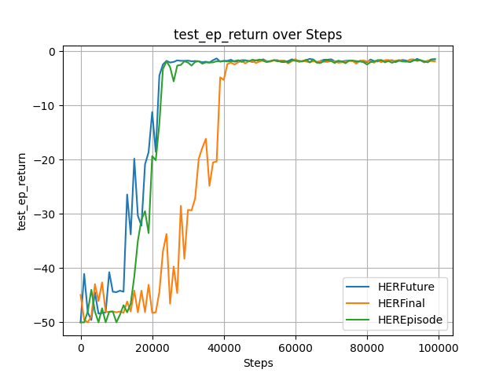
        </td>
        <td>
            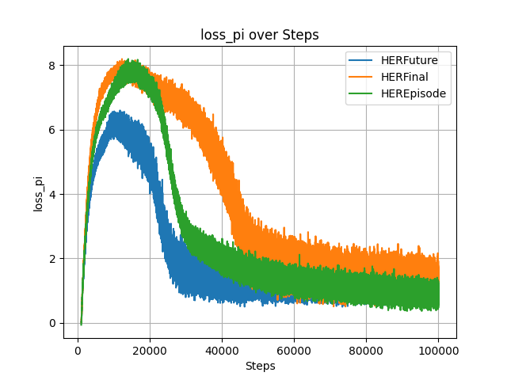
        </td>
    </tr>
</table>

Widać, że strategia "future" radzi sobie najlepiej, osiągając najwyższy zwrot testowy. Strategia "final" również radzi sobie dobrze, choć nieco gorzej niż "future". Strategia "episode" wypada najgorzej.

# Automatyczna regulacja alpha
Zgodnie z sugestią, zaimplementowałem automatyczną regulację alpha poprzez minimalizację $\log \alpha$, a nie bezpośrednio. Wygląda, że działa to poprawnie.

Do porówniania wykorzystałem bufor HER z strategią "future" i $\alpha=0.05$ oraz $\alpha$ ustawionego automatycznie. 

Zmiana parametru alpha:
<table>
    <tr>
        <td>
            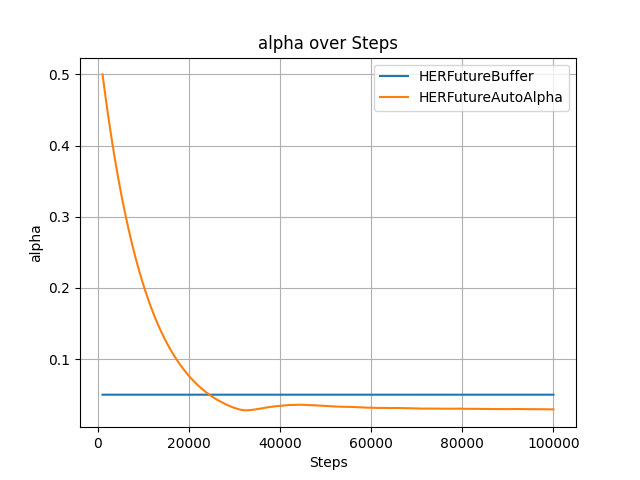
        </td>
        <td>
            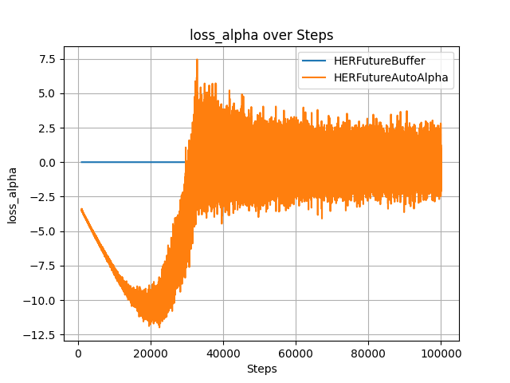
        </td>
    </tr>
</table>
widać, że automatyczna alpha zaczęła od ustalonej wartości 0.5, a następnie stopniowo spadała, osiągając wartość około 0.02 pod koniec treningu.

Wynik testowy:
<table>
    <tr>
        <td>
            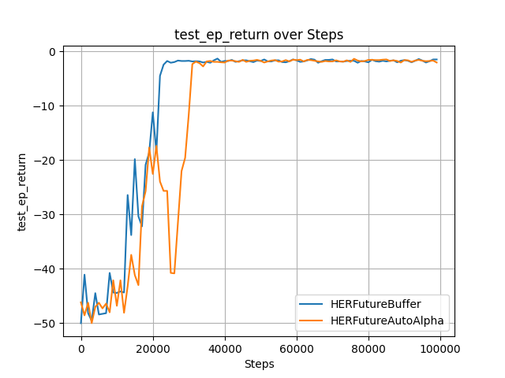
        </td>
        <td>
            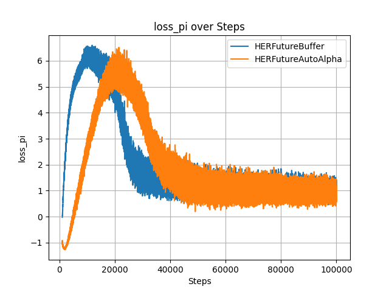
        </td>
    </tr>
</table>

Automatyczna alhpa w tym przypadku nie przebiła ręcznie ustawionej wartości 0.05, ale $\alpha=0.05$, była dobrą wartością, więc automatyczna regulacja
dostosowała się niewiele poprawiając wynik. Zbierzność rónież nastąpiła później niż dla ręcznie ustawionej alpha, co jest zrozumiałe, bo model musiał najpierw dostosować alpha do odpowiedniego poziomu. Niemniej jednak, automatyczna regulacja alpha okazała się być skuteczną metodą dostosowania tego parametru bez konieczności ręcznego tuningu.

## Wpływ liczby próbek HER
Przetestowałem również wpływ liczby próbek HER na wydajność modelu. Dla strategii "future" porównałem wartości her_n_sampled_goal ustawionee na 3 i 6. 
Dla HER futue i automatycznej alpha.

<table>
    <tr>
        <td>
            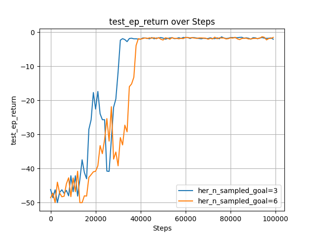
        </td>
        <td>
            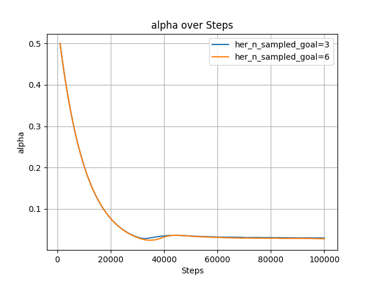
        </td>
    </tr>
</table>

Widać, że większa liczba próbek HER (6) prowadzi do opóźnienia zbieżności, ale ostatecznie osiąga podobny zwrot testowy.

# Finalne porównianie wydajności konfiguracji dla PandaReach-v3
Na koniec porównałem kilka konfiguracji dla środowiska PandaReach-v3, w tym zwykły `DictBuffer` i wszystkie wcześniej wymienione konfigruacje z HER i automatyczną regulacją alpha.

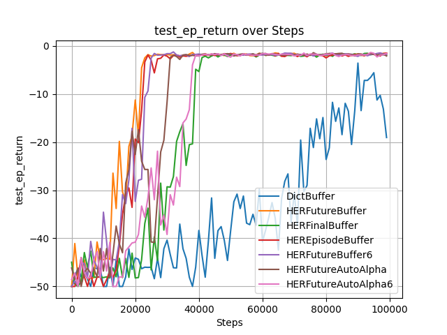

Widać, że przy 100'000 epizodów, konfiguracja z `DictBuffer` dopiero zaczyna zbieać, gdzie wszystkie konfiguracje z HER osiągnęły już znacznie wyższy zwrot testowy. Najlepszą wydajność osiągnęła konfiguracja z HER "future" i `alpha=0.05`.

# Trening na środowisku PandaPush-v3
Przetestowałem również konfigurację z HER "future" i automatyczną regulacją alpha na środowisku PandaPush-v3. Oto wyniki:

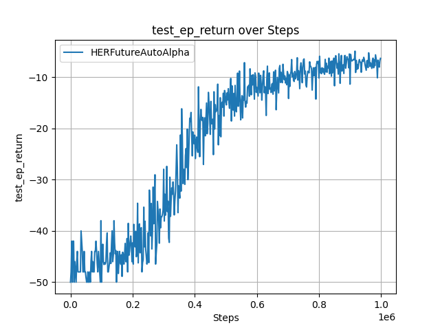
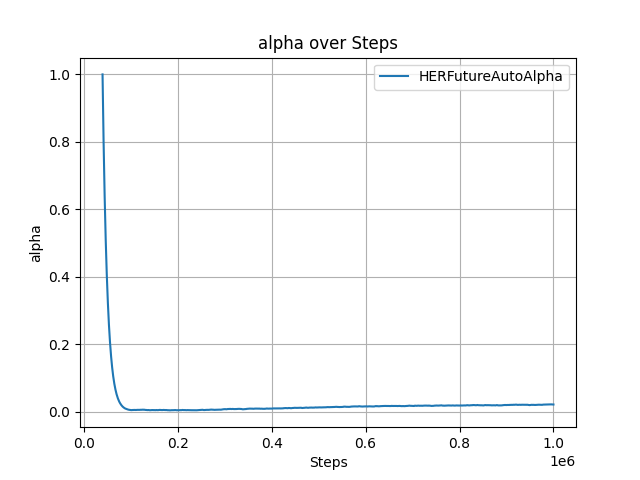

Dobrane parametry:
- Sieć: 3 warstwy ukryte: $[256, 256, 256]$
- Liczba próbek HER: 4
- $\gamma = 0.98$
- `batch_size = 128`
- `lr = 1e-4`
- Alpha: automatyczna regulacja zaczynając od $1.0$
- Liczba kroków startowych (zarówno `update_after`, jak i `start_steps`): 40'000
- Liczba kroków treningu: 1'000'000

Widać, że model czegoś się nauczył i właśnie zaczął się zbiegać, myślę że jeszcze około 100'000 kroków treningu dodatkowo minimalnie poprawiłoby wynik ale ogólnie wypadło to nawet nieźle, jednak dość dużo kroków było potrzebne żeby model zaczął się uczyć.

# Trening na środowisku PandaPickAndPlace-v3
Niestety na takich samych ustawieniach jak dla PandaPush-v3, model nie był w stanie nauczyć się niczego sensownego. Po około 1'000'000 kroków treningu, zwrot testowy nadal oscylował wokół $-40$.

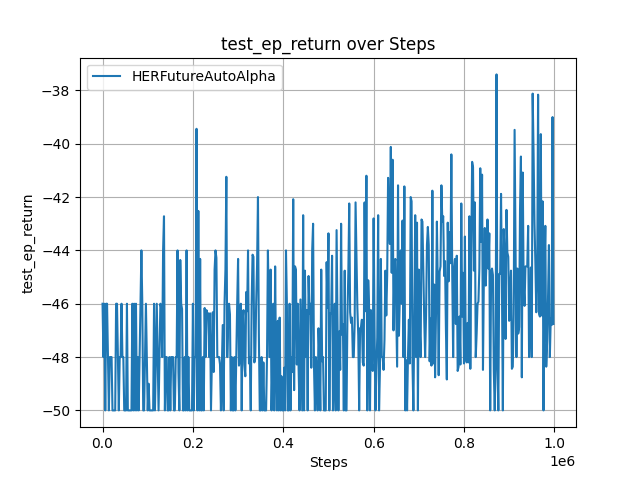

Widać jakąś tendencję ale raczej wygląda na słaby wynik jak na 4h nauki. Spróbowałem dodać też dodatkową warstwę ukrytą do sieci ale nie pomogło. 

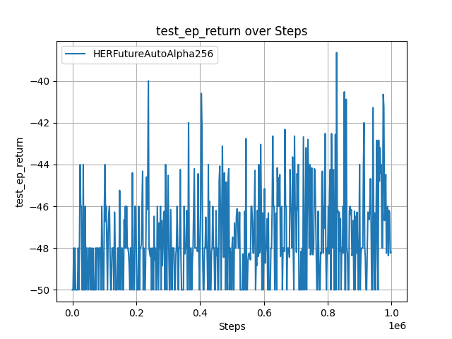

Zdecydowałem się zostawić eksperyment na $3 000 000$ kroków treningu i udało się nawet coś nauczyć, ale jakim kosztem... 14h treningu... Problem spowodowałem
przypadkiem bo zamiast tensorboarda podpiąłem swój skrypt do logowania, żeby mieć logi w jsonie, ale że bardzo na szybko to było, to zrobiłem naiwne zachowanie w pamięci,
i dump do pliku co $N$ wpisów (wpisów a nie kroków treningowych). Jak się okazało, po 3 milionach kroków treningu, wyjściowy plik ważył około 1.2GB, a jego dump trwał jakoś
minutę, więc średnio co 5k iteracji treninogwych miałem 1 minutę przerwy co sporo wydłużyło trening.

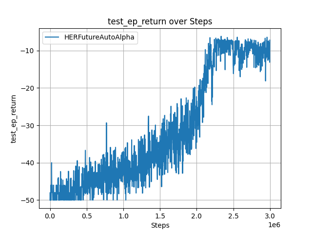

# Nagrania

W folderze `recordings` w archiwum z kodem znajdują się nagrania z najlepszych modeli dla środowisk które udało mi się uzyskać.
