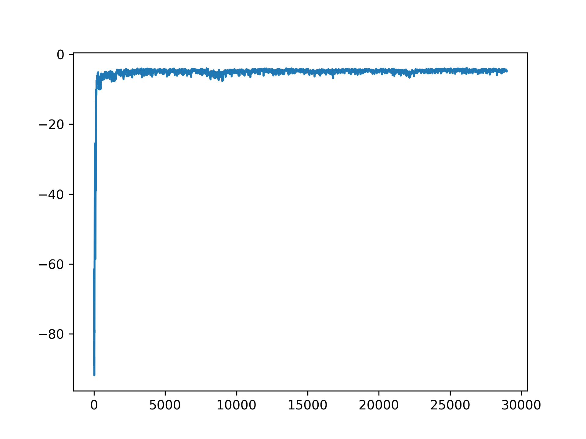
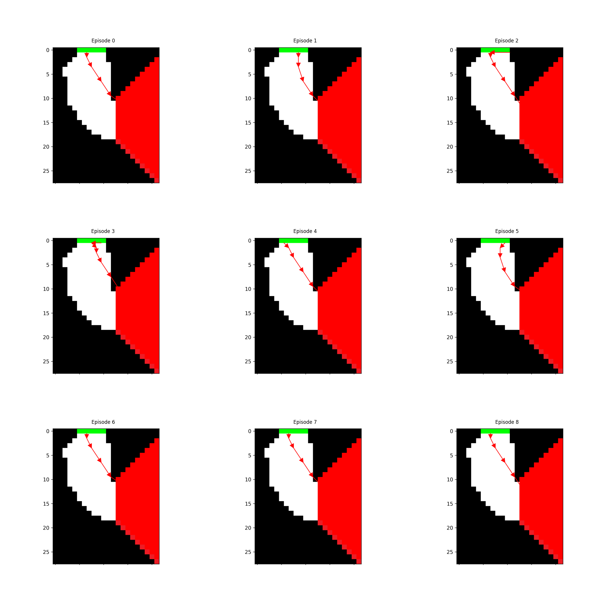
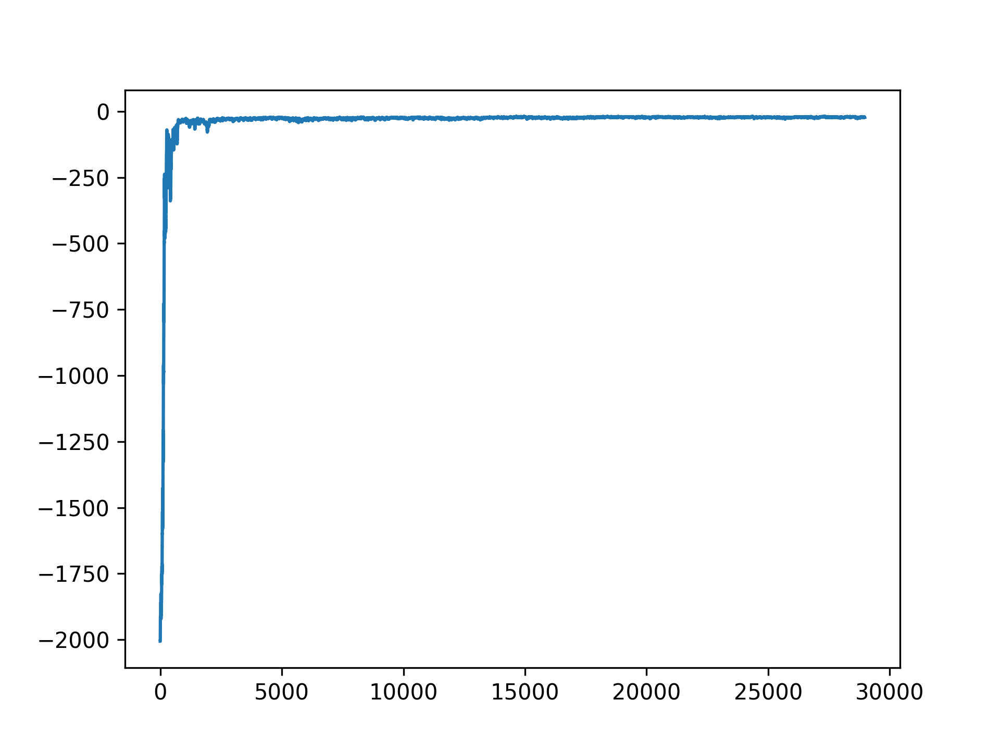
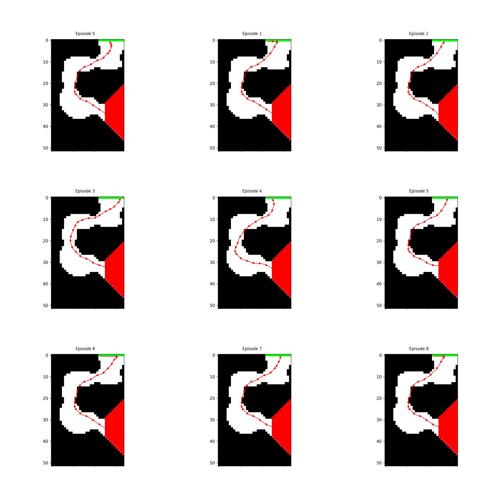
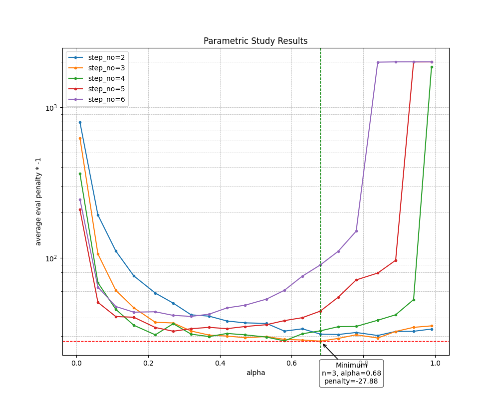
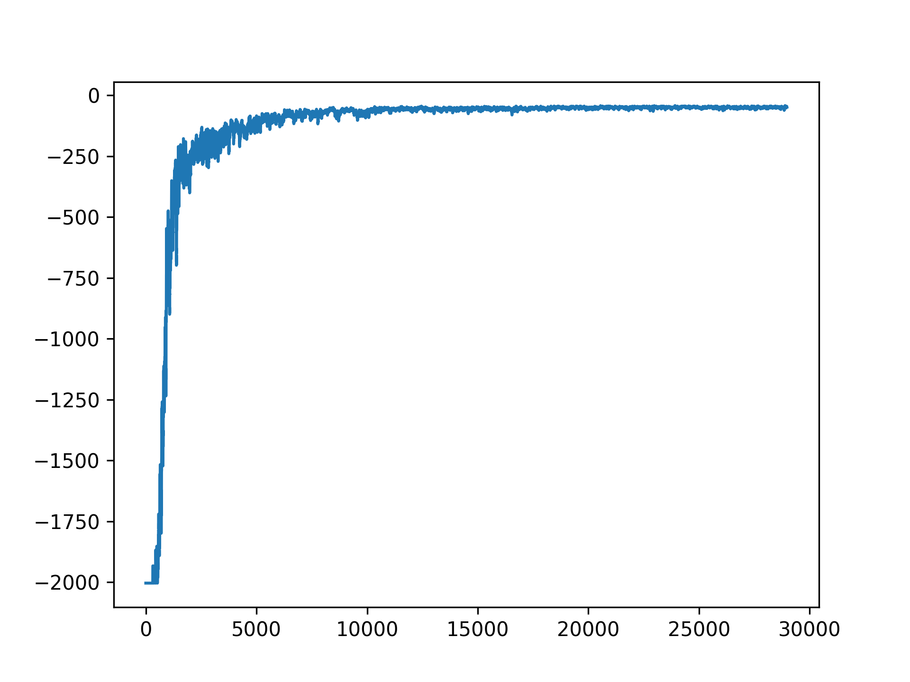
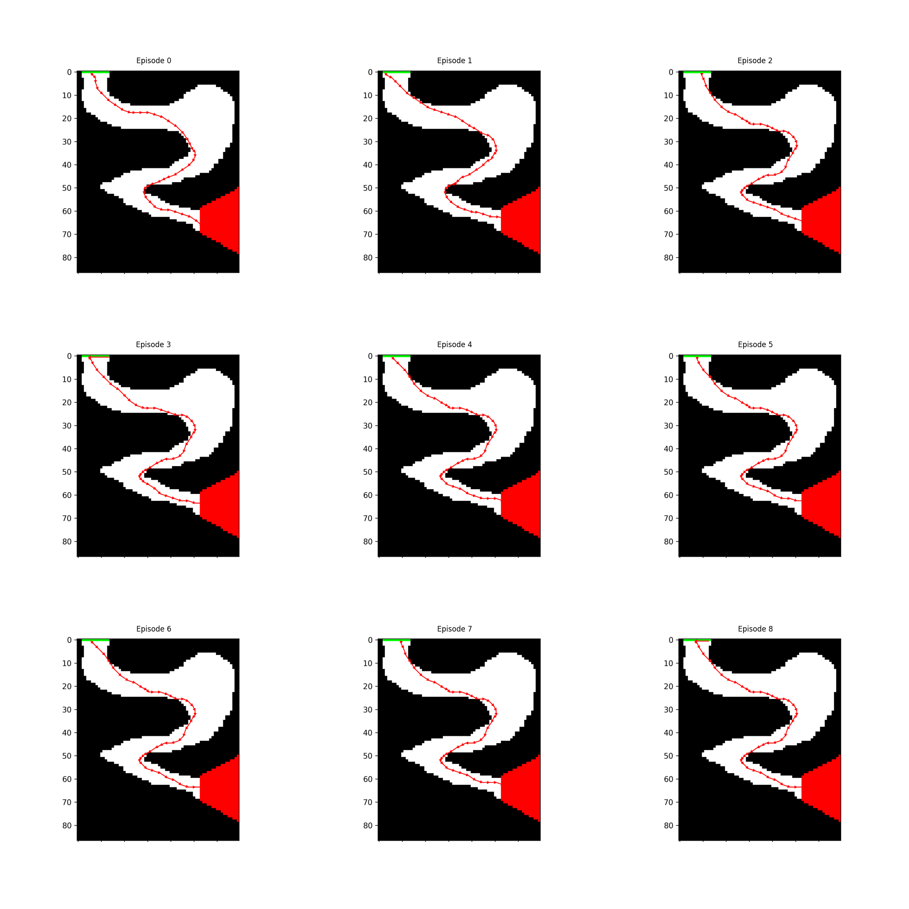
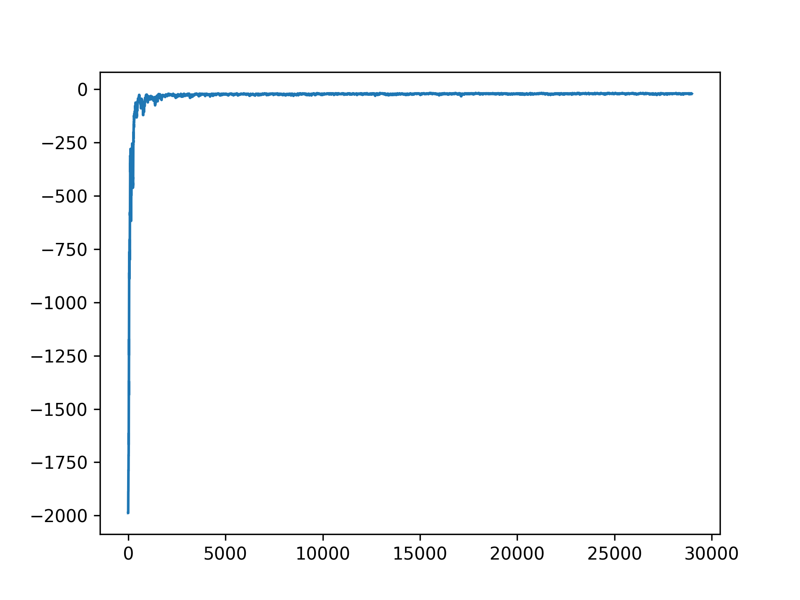
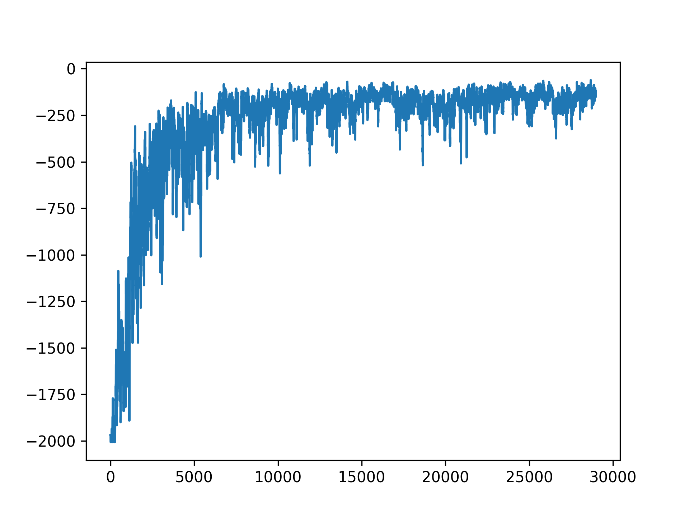
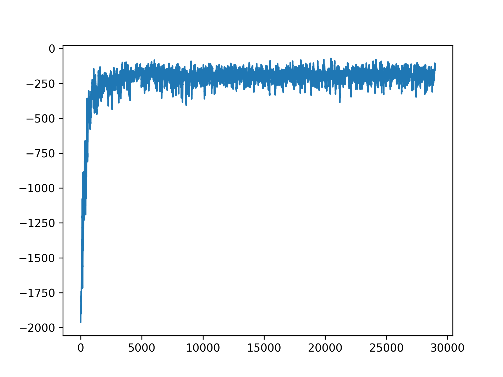

# Wstęp
Na wstępię wyjaśnię, że kod źródłowy, został mocno zmieniony przez narzędzia AI (ChatGPT 4.5). Oryginalny kod uzupełniłem samemu, ale później, gdy 
zacząłem ekeprymentować z Parametric Study i przepaliłem 24H wielowątkowego przetwarzania na 16 wątkach CPU (Ryzen 7 7800X3D), a nadal moje obliczenia się nie skończyły
(oczywiście nie ciągiem, parę razy zaczynałem trening od nowa, bo gdzieś wyskoczyło dzielenie przez zero, albo dane które zbierałem jednak mnie nie usatysfakcjonowały),
to stwierdziłem, że użyję numby, żeby przyspieszyć obliczenia. Okazało się to strzałem w dziesiątkę bo dla tragicznych przypadków typu `alpha=0.01 i step_size=2` które liczyły się całą noc i nadal się nie doliczyły, to trening zaczął trwać kilka minut. Nawet zakręt D, policzył mi się po poprawkach w około 5 minut. 

Oryginalny kod został przeniesiony do katalogu `problem_origianl`.

# Polityka E-greedy
## Trening zakrętu B

Historia kar treningu zakrętu B z parametrami `alpha=0.3` i `step_size=5`:

Przejazdy ewaluacyjne zakrętu B z tymi parametrami:

## Trening zakrętu C

Historia kar treningu zakrętu C z parametrami `alpha=0.3` i `step_size=5`:

Przejazdy ewaluacyjne zakrętu C z tymi parametrami:

## Studium parametryczne
Jako metrykę oceny parametrów, przyjąłem średnią karę liczoną na podstawie 10 epizodów ewaluacyjnych, liczonych co 10 epizodów treningowych.

Poniżej wykres:

## Trening zakrętu D

Historia kar treningu zakrętu D z parametrami `alpha=0.68` i `step_size=3` - optymalne znalezione w studium parametrycznym:

Przejazdy ewaluacyjne zakrętu D z tymi parametrami:

# Polityka z przyspieszaniem

Parametry to:
- `alpha=0.68`
- `step_size=3`
- `speeding_rate=0.2`

## Kary podstawowy - zakręt C

## Kary przyspieszający - zakręt C

## Kary przypieszający bez importance sampling - zakręt C

Widać na wykresach, że agenty ze speedingiem mają większy problem z nauczeniem się zakrętu. Widać też, że wyłączenie importance sampling przyspiesza trening
